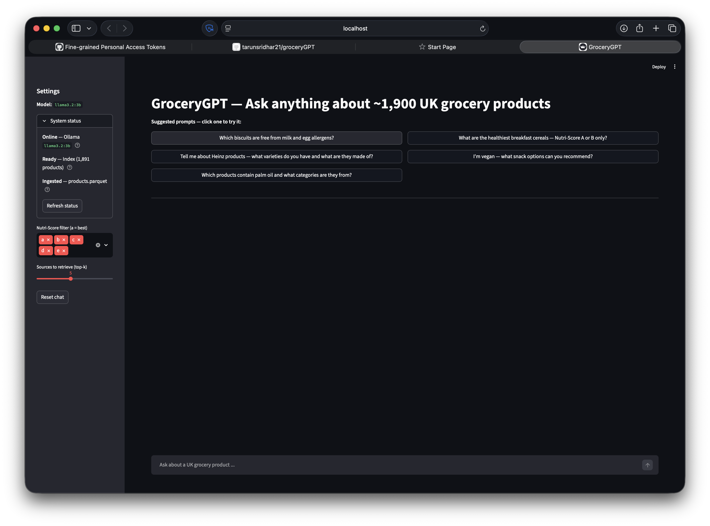
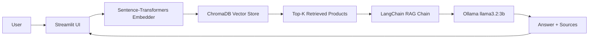

# GroceryGPT — RAG-based UK Grocery Intelligence Assistant

RAG over 2,000+ UK grocery products from Open Food Facts. Local LLM, embedded vector store, RAGAS-evaluated.

## Demo



## Architecture



## Stack

| Component | Library / Version | Role |
|-----------|-------------------|------|
| LLM | Ollama `llama3.2:3b` | Answer generation (fully local) |
| Embeddings | `BAAI/bge-small-en-v1.5` via sentence-transformers | Dense retrieval embeddings |
| Vector Store | ChromaDB (cosine distance) | ANN product index |
| RAG Orchestration | LangChain + langchain-ollama | Chain management |
| Evaluation | RAGAS | Faithfulness, relevancy, precision, recall |
| UI | Streamlit | Interactive chat interface |
| Data | Open Food Facts API v2 | 2,000+ UK products |
| Acceleration | Apple MPS / CUDA / CPU | Device-adaptive embedding |

## Results

Evaluated on 25 hand-crafted Q&A pairs using `llama3.2:3b` locally via Ollama.
Coverage = questions where the 3B model produced parseable structured output for that metric.
Full per-category breakdown in [`results/eval.md`](results/eval.md).

| Metric | Score | Coverage |
|--------|-------|----------|
| faithfulness | 0.5000 | 5/25 |
| answer_relevancy | 0.7486 | 4/25 |
| context_precision | N/A | 0/25 |
| context_recall | 0.4500 | 25/25 |

> `context_recall` is the most reliable metric (fully scored) as it uses sentence-level entailment rather than LLM JSON generation. The 3B model frequently times out on the structured-output metrics; re-running with `llama3.1:8b` would give full coverage across all four metrics.

## Quickstart

```bash
# 1. Clone the repository
git clone <your-repo-url>
cd grocerygpt

# 2. Create venv and install dependencies
make setup

# 3. Fetch 2,000 UK products from Open Food Facts
make ingest

# 4. Build the ChromaDB vector index
make index

# 5. Launch the Streamlit app
make app
```

## Evaluation Methodology

### Test Set Construction

The `eval/test_questions.json` file contains 25 hand-crafted question-answer pairs covering six categories:

- **ingredient_lookup** — asks what a product contains
- **allergen_filter** — queries for products safe for specific dietary restrictions
- **brand_recommendation** — asks about specific well-known UK brands
- **nutriscore_query** — asks about nutritional quality scores
- **vegan_vegetarian** — asks about plant-based or animal-free products
- **category_browsing** — browses product types
- **edge_case** — queries for products that do not exist in the catalogue

Ground truths are phrased generically to match realistic Open Food Facts data and avoid hardcoding specific product codes.

### RAGAS Metrics

All evaluation runs entirely locally using `llama3.2:3b` via Ollama and `BAAI/bge-small-en-v1.5` for embeddings — zero paid API calls.

| Metric | What it measures |
|--------|-----------------|
| **Faithfulness** | Whether the generated answer is grounded in the retrieved context (no hallucinations). Score: 0–1, higher is better. |
| **Answer Relevancy** | How well the answer addresses the question. Penalises verbose or off-topic answers. Score: 0–1. |
| **Context Precision** | What fraction of the retrieved contexts are actually relevant to answering the question. Measures retrieval precision. |
| **Context Recall** | Whether the retrieved contexts contain all the information needed to answer the question. Measures retrieval coverage. |

A high faithfulness + low context recall combination indicates the retriever is the bottleneck. A low faithfulness with adequate context suggests the LLM is drifting from the source material.

## Limitations and Next Steps

| Limitation | Possible improvement |
|------------|---------------------|
| 2,000-product sample (full OFF UK dataset is ~800k) | Nightly sync with full OFF dump; distributed indexing |
| No query rewriting or HyDE | Add hypothetical document embeddings or LLM-based query expansion |
| No cross-encoder re-ranking | Add a `cross-encoder/ms-marco-MiniLM-L-6-v2` re-ranker after retrieval |
| Single-turn conversation only | Add LangChain `ConversationBufferMemory` for multi-turn context |
| No fine-tuning | Fine-tune embedding model on grocery-specific query-product pairs |
| Ollama latency on CPU (~5s/query) | Quantised GGUF on GPU or switch to a smaller model for demo |

## Licence

MIT
